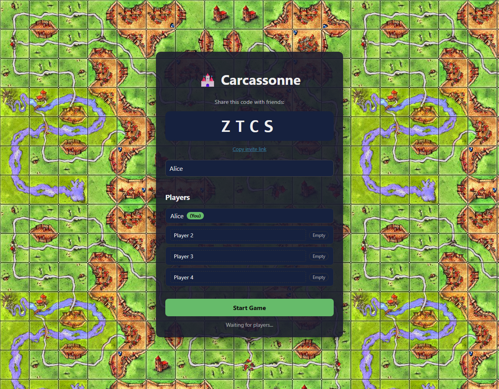
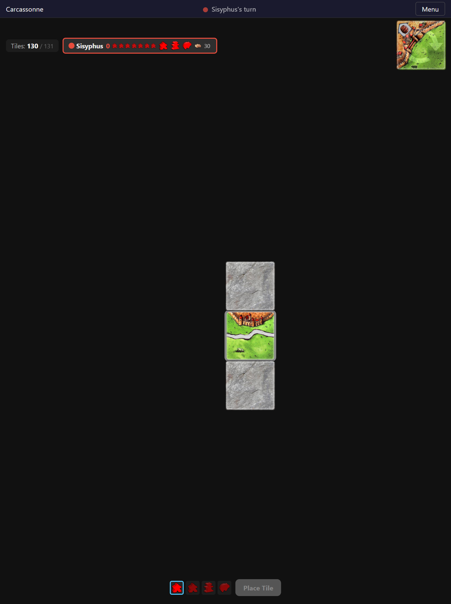
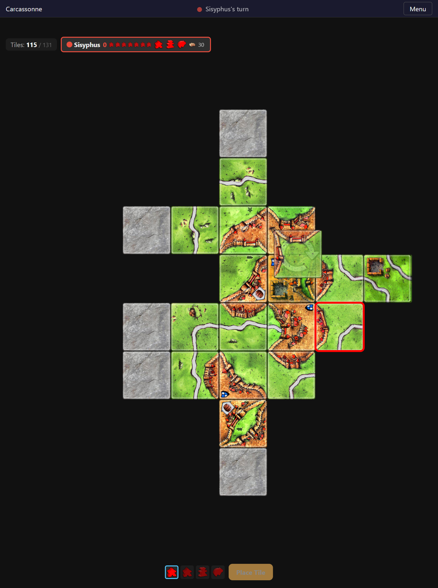
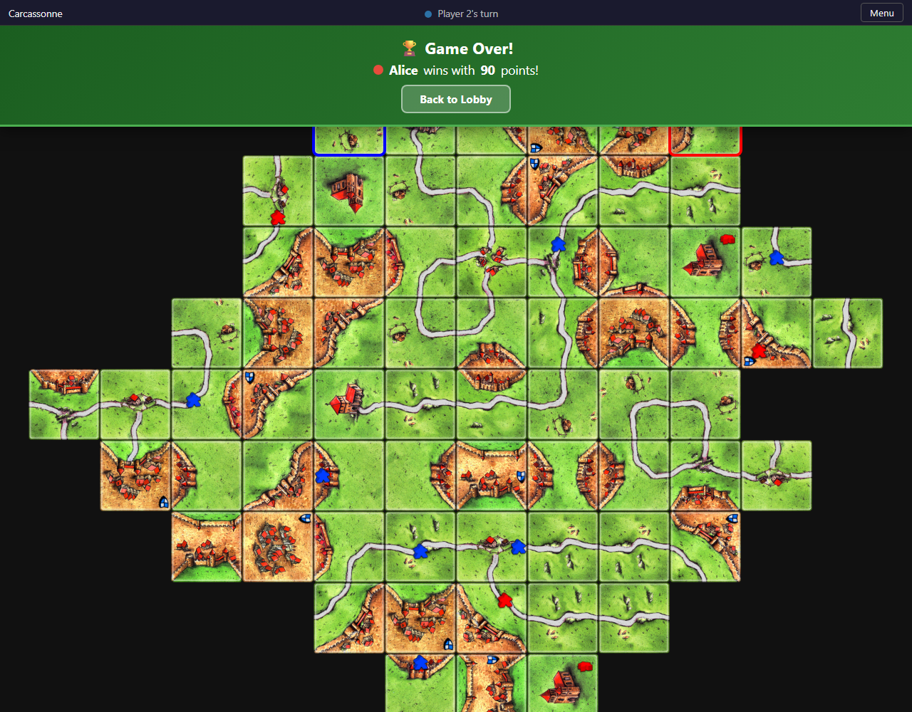

# Concarneau — Carcassonne P2P Web Game

A browser-based Carcassonne board game with solo play and peer-to-peer multiplayer. Originally an Express/MongoDB/WebSocket app, now a fully static SPA hosted on GitHub Pages — no server required.

Play solo, hot-seat with friends on one device, or create a room and share the code to play over WebRTC!

## Screenshots

| Lobby | Game Started | Mid-game | Game Over |
|-------|-------------|----------|-----------|
|  |  |  |  |

## Features

- **Solo play** — play a full game by yourself
- **Hot-seat multiplayer** — 2–6 players on one device
- **P2P multiplayer** — real-time WebRTC via PeerJS (room-based, up to 5 players)
- **Tile placement** — click valid board positions, then click tile to rotate
- **Meeple placement** — place meeples on cities, roads, cloisters, and fields (toggle on/off by clicking)
- **Scoring** — automatic scoring for completed features (cities, roads, cloisters) with end-game bonus
- **Game recovery** — saved game state survives browser refresh via localStorage
- **Expansions** (optional):
  - Inns & Cathedrals (large meeples)
  - Traders & Builders (builder, pig, goods tokens)
  - The Tower (tower pieces, captures)
- **Responsive SVG board** — pan & zoom with mouse wheel / pinch
- **Scoreboard** — live player scores, meeple counts, expansion piece indicators

## Quick Start

```bash
git clone <repo-url>
cd concarneau
npm install
npm run dev        # → http://localhost:5173/carcassonne/
```

Open the URL, enter your name, select player count and expansions, then click **Create Game**. The room code and invite link will appear — for solo/hot-seat games just click **Start Game**. Share the invite link for P2P multiplayer.

**Gameplay flow:** Click a highlighted valid placement on the board → click the floating tile to rotate → click **Place Tile** to confirm rotation → (optional) click a meeple outline to place/remove a meeple → click **Send Move** to finalize.

## Scripts

| Command | Description |
|---------|-------------|
| `npm run dev` | Start Vite dev server (hot-reload) |
| `npm run build` | Production build to `dist/` |
| `npm run preview` | Preview the production build |
| `npm test` | Run all tests (unit + E2E) |
| `npm run test:unit` | Run unit tests only (Vitest) |
| `npm run test:e2e` | Run E2E tests only (Playwright) |
| `npm run deploy` | Build + verify production output |

## Running E2E Tests

E2E tests use Playwright with Chromium. The test runner auto-starts the Vite dev server.

```bash
npx playwright install chromium   # one-time setup
npm run test:e2e
```

Tests cover:
- **Solo game** — create room, start game, board renders
- **P2P multiplayer** — hot-seat 2-player turn cycling
- **Persistence** — game state survives page reload

## Project Structure

```
src/
├── main.js                 # App entry point + router
├── game/
│   ├── GameLogic.js        # Game state machine (tile placement, scoring)
│   ├── TileData.js         # All tile definitions
│   └── FeatureTracker.js   # Connected feature tracking
├── rendering/
│   ├── GameBoard.js        # D3 SVG board renderer (tiles, meeples, valid placements)
│   ├── ActiveTile.js       # Floating active tile, rotation, meeple placement UI
│   └── ScoreBoard.js       # HTML scoreboard component
├── network/
│   ├── PeerManager.js      # PeerJS P2P networking (host + client)
│   ├── GameHost.js         # Host-side game orchestration
│   ├── GameClient.js       # Client-side game sync
│   ├── StateSync.js        # localStorage persistence
│   └── Protocol.js         # Message types & helpers
├── ui/
│   ├── LobbyView.js        # Create / join game lobby
│   ├── GameView.js         # Main game screen (orchestrates rendering + logic)
│   ├── Router.js           # Hash-based SPA router
│   ├── ChatPanel.js        # In-game chat
│   └── SettingsPanel.js    # Settings UI
├── utils/
│   └── EventEmitter.js     # Simple event emitter
└── styles/
    ├── game.css            # Game-specific styles
    └── modern.css          # Global styles
```

## GitHub Pages Deployment

This project is configured for GitHub Pages at the `/carcassonne/` sub-path.

1. Push to the `main` branch
2. In your repo settings → Pages → set source to GitHub Actions
3. The included `.github/workflows/deploy.yml` workflow builds and deploys automatically

The deployed site will be available at `https://<org>.github.io/carcassonne/`.

## Technical Stack

- **Build**: [Vite](https://vitejs.dev/) — fast dev server + optimized builds
- **Rendering**: [D3.js v7](https://d3js.org/) — SVG zoom/pan, data joins, transitions
- **Networking**: [PeerJS](https://peerjs.com/) — WebRTC P2P via cloud signaling server
- **Tests**: [Vitest](https://vitest.dev/) (unit) + [Playwright](https://playwright.dev/) (E2E)
- **CI**: GitHub Actions — test, build, deploy

## License

Original project by [btouellette](https://github.com/btouellette/concarneau). Migrated to static SPA.
